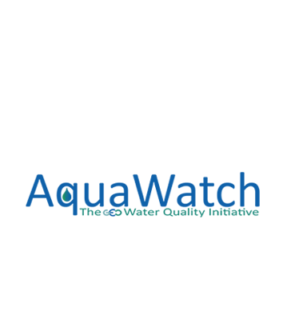

<table style="width:100%">
<tr>
   
    <th>  <a href="{{ item.url }}">{{ item.title }}</a> </th>
   
</tr>
</table>

{:width="100%"} 

{:height="50px"}  {:height="50px"}  {:height="36px"} {:height="50px"} {:height="50px"} 

## Collaborators
* [Ray, S. (PI) ](https://www.gla.ac.uk/schools/mathematicsstatistics/staff/surajitray/)
* [Scott, Professor M](https://www.gla.ac.uk/schools/mathematicsstatistics/staff/escott/)
* [Miller, Dr CA](https://www.gla.ac.uk/schools/mathematicsstatistics/staff/claireferguson/) 	
* [Helliwell, Dr RC](https://www.hutton.ac.uk/staff/rachel-helliwell)
* [Glendell, Dr M](https://www.hutton.ac.uk/staff/miriam-glendell) 
* [Sinha, Professor R](http://home.iitk.ac.in/~rsinha/)
* [Read, Dr D S](https://www.ceh.ac.uk/staff/daniel-read)
* [Bowes, Dr M](https://www.ceh.ac.uk/staff/mike-bowes) 
* [Tyler, Professor AN](https://www.stir.ac.uk/people/257330)
* [Hunter, Dr P D](https://www.stir.ac.uk/people/255710) 	
## Funder 

[Link to project on EPSRC-GOW](https://gow.epsrc.ukri.org/NGBOViewGrant.aspx?GrantRef=EP/T003669/1)  

## Partner institutions

---
{:height="50px"}  {:height="50px"}  {:height="50px"} {:height="50px"} {:height="50px"} 

---

## Supporting partners
---
{:height="50px"}  {:height="50px"}   {:height="50px"}  {:height="50px"}

---

