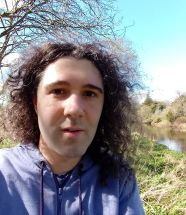
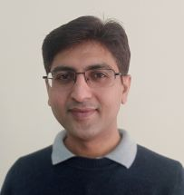
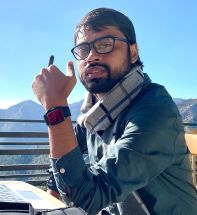

The Ramganga Water Quality Fusion project is a collaboration between two leading UK universities, one leading Indian University and two UK research institutes. The consortium includes researchers with expertise in statistics, environmental modeling and  remote sensing. (to be edited)

## Team
### University of Glasgow
* [Ray, S. (PI) ](https://www.gla.ac.uk/schools/mathematicsstatistics/staff/surajitray/)
* [Scott, Professor M](https://www.gla.ac.uk/schools/mathematicsstatistics/staff/escott/)
* [Miller, Professor CA](https://www.gla.ac.uk/schools/mathematicsstatistics/staff/claireferguson/) 
* [Wilkie, Dr CJ](https://www.gla.ac.uk/schools/mathematicsstatistics/staff/craigwilkie/)

###	 James Hutton Institute
* [Helliwell, Dr RC](https://www.hutton.ac.uk/staff/rachel-helliwell)
* [Glendell, Dr M](https://www.hutton.ac.uk/staff/miriam-glendell) 

### Indian Institute of Technology, Kanpur
* [Sinha, Professor R](http://home.iitk.ac.in/~rsinha/)
* [Singh, Dr MN](https://www.researchgate.net/profile/Manudeo_Singh)
* [Choudhary, Dr BC](https://www.researchgate.net/profile/Bharat-Choudhary-2)

### UK Centre for Ecology and Hydrology
* [Read, Dr D S](https://www.ceh.ac.uk/staff/daniel-read)
* [Bowes, Dr M](https://www.ceh.ac.uk/staff/mike-bowes) 

### University of Stirling
* [Tyler, Professor AN](https://www.stir.ac.uk/people/257330)
* [Hunter, Dr P D](https://www.stir.ac.uk/people/255710) 	
* [Mascarenhas, Dr V](https://www.stir.ac.uk/people/1677279)

## Team with pictures and link

### University of Glasgow
 
<!--- -->

<!--- -->
 
<!--- -->
 

###	 James Hutton Institute
 
<!--- -->
 

### Indian Institute of Technology, Kanpur
 
  
  

### UK Centre for Ecology and Hydrology
 
  

### University of Stirling

 	

## Funder 

[Link to project on EPSRC-GOW](https://gow.epsrc.ukri.org/NGBOViewGrant.aspx?GrantRef=EP/T003669/1)  

## Partner institutions

---
[{:height="50px"}](https://www.gla.ac.uk/)  [{:height="50px"}](https://www.stir.ac.uk/)  [{:height="50px"}](https://www.ceh.ac.uk/) [{:height="50px"}](https://www.hutton.ac.uk/) [{:height="50px"}](https://www.iitk.ac.in/) 

---

## Supporting partners
---
[{:height="50px"}](https://iukwc.org/)  [{:height="50px"}](https://nmcg.nic.in/NamamiGanga.aspx)   [{:height="50px"}](https://www.geoaquawatch.org/)  [{:height="50px"}](https://www.mahseertrust.org/)

---

